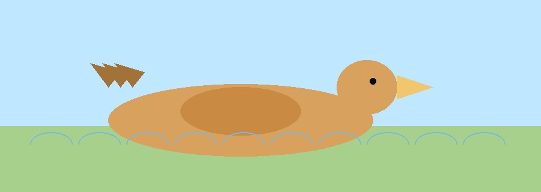

Mallard ducks are familiar dabbling ducks found across Europe and North America, often seen on lakes, rivers, and wetlands. Their broad diet, adaptable habits, and conspicuous plumage make them a classic example of a highly mobile waterfowl species.

Lake Constance, on the border of Germany, Switzerland, and Austria, is one of Europe’s largest freshwater lakes and an important stopover for migratory birds. The lake and surrounding wetlands provide feeding and resting habitat for many ducks during breeding and wintering seasons.

The GPS tracking data used here follows individual mallards as they move through this region, revealing patterns of daily movement, seasonal behavior, and the geographic range of the birds across the study area.

<div style="display: flex; justify-content: center;">
  
</div>

```{r}
#| message: false
library(tidyverse)
library(sf)
```

```{r}
library(ggplot2)

duck_data <- data.frame(
  day = 1:5,
  ducks = c(12, 18, 25, 20, 31)
)

ggplot(duck_data, aes(day, ducks)) +
  geom_line(color = "#2b7a78") +
  geom_point(size = 3, color = "#2b7a78") +
  labs(
    title = "Mallard Duck Counts",
    x = "Day",
    y = "Number of ducks"
  ) +
  theme_minimal()
```

```{r}
mallards <- read_csv("data/mallards.csv")

head(mallards, 10)
```

```{r}
mallards |>
  count(duck_id) |>
  arrange(desc(n))
```

```{r}
mallards |>
  summarise(
    min_lat = min(lat),
    max_lat = max(lat),
    min_lon = min(long),
    max_lon = max(long)
  )
```

```{r}
#| cache: true
mallards <- readRDS("data/mallards.rds")
```
